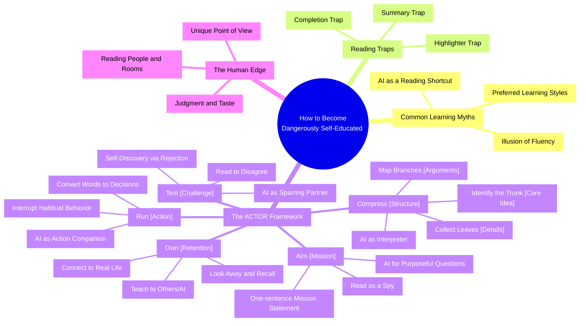

> [!NOTE]
> **Anamne Chrome Extension Synced File**
> Source: [[00_Imports/AI Conversations/ChatGPT/httpswww.youtube.comwatchv=VeU6gScy92s.md|Original Anamne Import]]

# How To Become Dangerously Self-Educated (with AI) - YouTube

**Original Source**: [https://www.youtube.com/watch?v=VeU6gScy92s](https://www.youtube.com/watch?v=VeU6gScy92s)

## 📝 Summarization
This guide outlines how to become effectively self-educated, specifically leveraging AI tools for deeper learning and knowledge retention. It addresses the common challenge of not finishing books, offering strategies to move beyond superficial consumption towards a more impactful understanding of information.

## 🛠️ NotebookLM Artifacts
```meta-bind-button
label: 📝 Generate NotebookLM Summary
icon: "file-text"
style: primary
hidden: false
actions:
  - type: command
    command: knowledge-pipeline:generate-summary
```
```meta-bind-button
label: 🧠 Generate Mind Map
icon: "git-branch"
style: primary
hidden: false
actions:
  - type: command
    command: knowledge-pipeline:generate-mind-map
```
```meta-bind-button
label: 🎙️ Generate Podcast (Audio)
icon: "headphones"
style: primary
hidden: false
actions:
  - type: command
    command: knowledge-pipeline:generate-podcast
```
```meta-bind-button
label: 🎬 Generate Cinematic Video
icon: "video"
style: primary
hidden: false
actions:
  - type: command
    command: knowledge-pipeline:generate-video
```

### Generated Attachments
- **Podcast Audio**: 
- **Cinematic Video**:

## 🧠 Mind Map Diagram
