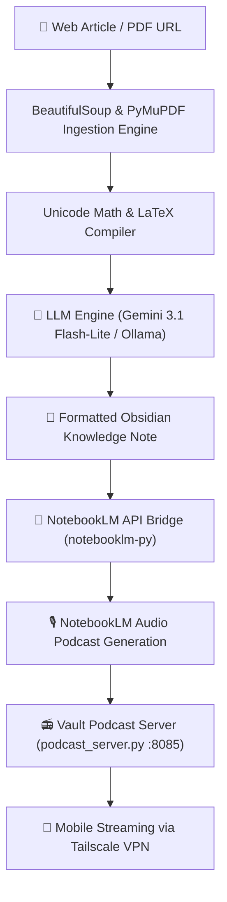

An automated ingestion pipeline for Obsidian that scrapes web links, generates high-quality AI summaries, structures research stubs, and builds interactive NotebookLM mind maps and podcast feeds.

---

## 🏗️ Architecture

---

## 🛠️ Core Features

* **Intelligent Scraping**: Extracts article title and body text from external web links, bypassing generic title stubs.
* **Hybrid LLM Support**: 
  * Cloud: Google Gemini API (2.5 Flash/Pro) with credentials stored securely in your OS Keychain.
  * Local: Offline Ollama endpoint (Qwen, Gemma, Llama) for 100% private notes processing.
* **Unicode Math Bridge**: A regex-based compiler that translates LaTeX expressions into raw Unicode equivalents, enabling mathematical formatting to render natively inside Mermaid.js mind maps without crashing.
* **Self-Healing Rollbacks**: On source upload failures during Google Notebook creation, the plugin executes state rollbacks to reset cache tokens, ensuring a smooth, single-click retry.

## 🔒 Security

No plaintext API keys or OAuth tokens are saved on disk. The plugin retrieves keys directly from Obsidian's secure keyring (`app.secretStorage.getSecret`), keeping your credentials protected at rest.

## 🙏 Acknowledgments

* **notebooklm-py**: Integrates the unofficial [notebooklm-py](https://github.com/gitbuda/notebooklm-py) client to enable automated document uploads and Google Notebook creation directly from the Obsidian pipeline.

## 📻 Integrated Podcast Server

The plugin features an integrated, lightweight podcast server (`podcast_server.py`) that runs locally and hosts generated NotebookLM audio podcasts. It is dynamically served directly inside your vault.
* **Auto-Discovery Port**: The server automatically reads its port configuration from the plugin settings page (default: `8085`).
* **Tailscale Ready**: Stream your podcasts on the go by connecting your mobile device over Tailscale and pointing your media player hub to the host IP.
